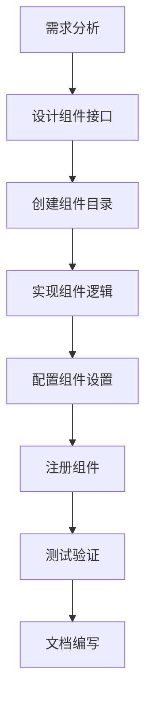
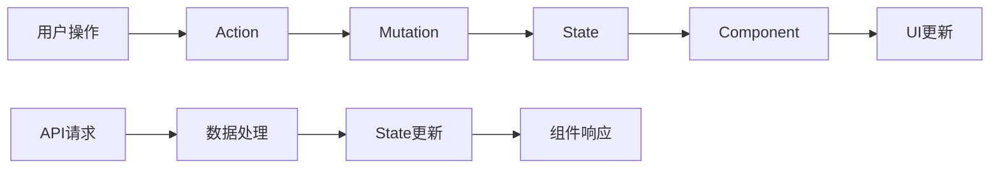

# DataRoom 数据可视化大屏开发指导文档

## 目录
- [项目技术架构深度解析](#项目技术架构深度解析)
- [核心开发流程指南](#核心开发流程指南)
- [组件开发详细指南](#组件开发详细指南)
- [数据流与状态管理](#数据流与状态管理)
- [Vue3 + TypeScript 迁移方案](#vue3--typescript-迁移方案)
- [性能优化策略](#性能优化策略)
- [扩展开发指南](#扩展开发指南)
- [常见问题与解决方案](#常见问题与解决方案)

## 项目技术架构深度解析

### 1. 整体架构设计

#### 1.1 分层架构
```
┌─────────────────────────────────────────┐
│                UI 层                    │
├─────────────────────────────────────────┤
│              组件层                     │
│  ┌─────────┐ ┌─────────┐ ┌─────────┐    │
│  │基础组件 │ │图表组件 │ │3D组件   │    │
│  └─────────┘ └─────────┘ └─────────┘    │
├─────────────────────────────────────────┤
│              服务层                     │
│  ┌─────────┐ ┌─────────┐ ┌─────────┐    │
│  │状态管理 │ │数据服务 │ │工具服务 │    │
│  └─────────┘ └─────────┘ └─────────┘    │
├─────────────────────────────────────────┤
│              数据层                     │
│  ┌─────────┐ ┌─────────┐ ┌─────────┐    │
│  │API接口  │ │本地存储 │ │配置文件 │    │
│  └─────────┘ └─────────┘ └─────────┘    │
└─────────────────────────────────────────┘
```

#### 1.2 核心技术栈分析

**前端框架：**
- Vue 2.x + Vue Router 3.x + Vuex
- Element UI 2.15.6 (UI组件库)
- ES6+ (JavaScript语言特性)

**图表渲染引擎：**
- ECharts 5.2.2 (主要图表库)
- @antv/g2plot 2.4.31 (蚂蚁G2图表)
- @visactor/vchart 1.13.9 (字节VChart)
- @jiaminghi/data-view 2.10.0 (大屏装饰组件)

**3D渲染：**
- Three.js 0.137.5 (3D图形库)
- Vue-Konva 2.1.7 (2D Canvas库)

**工程化工具：**
- Vue CLI (构建工具)
- Webpack (模块打包)
- Babel (JS编译)
- ESLint (代码规范)
- Jest (单元测试)

### 2. 模块化设计原理

#### 2.1 组件注册机制

项目采用动态组件注册机制，通过 `require.context` 实现组件的自动发现和注册：

```javascript
// packages/js/utils/configImport.js
function importComponentSettingConfig (files) {
  files.keys().filter(key => {
    return key.match(/settingConfig/)
  }).forEach(key => {
    const reg = new RegExp('(.\/)(.*)(\/)')
    let moduleName = key.match(reg)[0].replace(/(\.\/)|(\/)/g, '')
    moduleName = moduleName.replace(moduleName[0], moduleName[0].toLowerCase())
    setModules[moduleName] = files(key).settingConfig
    dataModules[moduleName] = files(key).dataConfig
  })
}
```

#### 2.2 配置驱动架构

每个组件都遵循统一的配置结构：

```javascript
// 组件配置结构
{
  name: '组件名称',
  title: '显示标题', 
  icon: '图标',
  className: 'Java后端类名',
  w: 200,        // 默认宽度
  h: 60,         // 默认高度
  x: 0,          // 默认X坐标
  y: 0,          // 默认Y坐标
  type: 'componentType'
}
```

## 核心开发流程指南

### 1. 开发环境搭建

#### 1.1 环境要求
- Node.js >= 14.x
- npm >= 6.x 或 yarn >= 1.x
- Git

#### 1.2 项目启动
```bash
# 安装依赖
npm install

# 开发模式启动
npm run dev

# 构建生产版本
npm run build

# 构建组件库
npm run lib
```

#### 1.3 目录结构详解
```
packages/
├── BasicComponents/     # 基础组件
│   ├── Texts/          # 文本组件
│   ├── Numbers/        # 数字组件
│   └── ...
├── BigScreenDesign/    # 大屏设计器
├── BigScreenRun/       # 大屏运行时
├── Vcharts/           # VChart图表组件
├── G2Plots/           # G2Plot图表组件
├── ThreeRender/       # 3D渲染组件
├── js/
│   ├── api/           # API接口
│   ├── config/        # 配置文件
│   ├── mixins/        # 混入
│   ├── store/         # 状态管理
│   └── utils/         # 工具函数
└── assets/            # 静态资源
```

### 2. 组件开发生命周期

#### 2.1 组件开发流程


#### 2.2 组件文件结构
```
ComponentName/
├── index.vue          # 组件主文件
├── setting.vue        # 配置面板
├── settingConfig.js   # 配置定义
└── README.md          # 组件文档
```

## 组件开发详细指南

### 1. 基础组件开发

#### 1.1 创建新组件

**步骤1：创建组件目录**
```bash
mkdir packages/BasicComponents/MyComponent
```

**步骤2：实现组件主文件**
```vue
<!-- packages/BasicComponents/MyComponent/index.vue -->
<template>
  <div class="my-component" :style="componentStyle">
    <!-- 组件内容 -->
  </div>
</template>

<script>
import commonMixins from 'data-room-ui/js/mixins/commonMixins'
import linkageMixins from 'data-room-ui/js/mixins/linkageMixins'

export default {
  name: 'MyComponent',
  mixins: [commonMixins, linkageMixins],
  data() {
    return {
      // 组件数据
    }
  },
  computed: {
    componentStyle() {
      return {
        width: this.config.w + 'px',
        height: this.config.h + 'px',
        // 其他样式
      }
    }
  },
  methods: {
    // 组件方法
  }
}
</script>
```

**步骤3：创建配置面板**
```vue
<!-- packages/BasicComponents/MyComponent/setting.vue -->
<template>
  <div class="my-component-setting">
    <!-- 配置项 -->
  </div>
</template>

<script>
export default {
  name: 'MyComponentSetting',
  props: {
    config: {
      type: Object,
      default: () => ({})
    }
  }
}
</script>
```

**步骤4：定义配置结构**
```javascript
// packages/BasicComponents/MyComponent/settingConfig.js
export const settingConfig = {
  // 配置项定义
}

export const dataConfig = {
  // 数据配置
}
```

#### 1.2 图表组件开发

图表组件需要继承图表基类并实现特定接口：

```vue
<template>
  <div class="chart-container" :style="componentStyle">
    <div ref="chartContainer" class="chart-content"></div>
  </div>
</template>

<script>
import commonMixins from 'data-room-ui/js/mixins/commonMixins'
import chartMixins from 'data-room-ui/js/mixins/chartMixins'

export default {
  name: 'MyChart',
  mixins: [commonMixins, chartMixins],
  data() {
    return {
      chart: null
    }
  },
  mounted() {
    this.initChart()
  },
  methods: {
    initChart() {
      // 初始化图表
    },
    updateChart() {
      // 更新图表数据
    },
    resizeChart() {
      // 响应尺寸变化
    }
  }
}
</script>
```

### 2. 3D组件开发

3D组件基于Three.js开发，需要特殊的渲染流程：

```vue
<template>
  <div class="three-component" :style="componentStyle">
    <canvas ref="threeCanvas"></canvas>
  </div>
</template>

<script>
import * as THREE from 'three'
import commonMixins from 'data-room-ui/js/mixins/commonMixins'

export default {
  name: 'My3DComponent',
  mixins: [commonMixins],
  data() {
    return {
      scene: null,
      camera: null,
      renderer: null,
      animationId: null
    }
  },
  mounted() {
    this.init3D()
    this.animate()
  },
  beforeDestroy() {
    this.dispose()
  },
  methods: {
    init3D() {
      // 初始化3D场景
    },
    animate() {
      // 动画循环
    },
    dispose() {
      // 清理资源
    }
  }
}
</script>
```

## 数据流与状态管理

### 1. Vuex状态结构

```javascript
// packages/js/store/state.js
export default {
  pageInfo: {           // 页面信息
    w: 1920,           // 画布宽度
    h: 1080,           // 画布高度
    bg: '',            // 背景
    theme: 'dark',     // 主题
    cacheDatasets: [], // 缓存数据集
    refreshConfig: {}, // 刷新配置
    fitMode: 'auto'    // 自适应模式
  },
  chartList: [],       // 图表列表
  activeCode: '',      // 当前选中组件
  pageLoading: false,  // 页面加载状态
  // ... 其他状态
}
```

### 2. 数据流向



### 3. 组件间通信

#### 3.1 EventBus事件总线
```javascript
// packages/js/utils/eventBus.js
import Vue from 'vue'
export const EventBus = new Vue()

// 发送事件
EventBus.$emit('event-name', data)

// 监听事件
EventBus.$on('event-name', handler)
```

#### 3.2 组件联动机制
```javascript
// 联动配置
const linkageConfig = {
  source: 'sourceComponentCode',
  target: 'targetComponentCode',
  field: 'linkageField',
  condition: 'equal'
}
```

## Vue3 + TypeScript 迁移方案

### 1. 迁移可行性评估

#### 1.1 技术可行性：★★★★☆ (4/5)

**优势：**
- 项目模块化程度高，便于逐步迁移
- 组件结构清晰，迁移路径明确
- 已有完善的构建配置，可复用部分配置
- 第三方库大多支持Vue3

**挑战：**
- 大量Vue2特有语法需要重写
- Vuex需要升级到Pinia
- 部分第三方库可能需要替换
- 类型定义工作量较大

#### 1.2 工作量评估

| 模块 | 迁移难度 | 预估工时 | 风险等级 |
|------|----------|----------|----------|
| 基础组件 | 中等 | 40人天 | 低 |
| 图表组件 | 中等 | 60人天 | 中 |
| 3D组件 | 高 | 30人天 | 高 |
| 设计器 | 高 | 80人天 | 高 |
| 状态管理 | 高 | 20人天 | 中 |
| 工具函数 | 低 | 15人天 | 低 |
| **总计** | - | **245人天** | - |

### 2. 迁移策略

#### 2.1 渐进式迁移方案

**阶段1：环境准备 (2周)**
```bash
# 1. 升级构建工具
npm install vue@next @vue/cli-service@next
npm install typescript @vue/typescript

# 2. 添加TypeScript配置
# tsconfig.json
{
  "compilerOptions": {
    "target": "ES2020",
    "module": "ESNext",
    "moduleResolution": "node",
    "strict": true,
    "jsx": "preserve",
    "esModuleInterop": true,
    "skipLibCheck": true,
    "forceConsistentCasingInFileNames": true,
    "baseUrl": ".",
    "paths": {
      "@/*": ["src/*"],
      "data-room-ui/*": ["packages/*"]
    }
  },
  "include": [
    "src/**/*.ts",
    "src/**/*.tsx",
    "src/**/*.vue",
    "packages/**/*.ts",
    "packages/**/*.vue"
  ]
}
```

**阶段2：核心架构迁移 (4周)**
```typescript
// 1. 状态管理迁移到Pinia
// stores/index.ts
import { createPinia } from 'pinia'
import { useMainStore } from './main'

export const pinia = createPinia()
export { useMainStore }

// stores/main.ts
import { defineStore } from 'pinia'
import type { PageInfo, ChartItem } from '@/types'

export const useMainStore = defineStore('main', {
  state: () => ({
    pageInfo: {} as PageInfo,
    chartList: [] as ChartItem[],
    activeCode: '',
    pageLoading: false
  }),
  
  getters: {
    activeChart: (state) => {
      return state.chartList.find(item => item.code === state.activeCode)
    }
  },
  
  actions: {
    setActiveCode(code: string) {
      this.activeCode = code
    },
    
    updateChart(chart: ChartItem) {
      const index = this.chartList.findIndex(item => item.code === chart.code)
      if (index !== -1) {
        this.chartList[index] = chart
      }
    }
  }
})
```

**阶段3：组件迁移 (8周)**
```vue
<!-- 基础组件迁移示例 -->
<template>
  <div class="text-component" :style="componentStyle">
    {{ displayText }}
  </div>
</template>

<script setup lang="ts">
import { computed, ref, onMounted } from 'vue'
import { useCommonMixins } from '@/composables/useCommonMixins'
import type { TextConfig } from '@/types/components'

interface Props {
  config: TextConfig
}

const props = defineProps<Props>()
const emit = defineEmits<{
  update: [config: TextConfig]
}>()

const { componentStyle } = useCommonMixins(props.config)

const displayText = computed(() => {
  return props.config.text || '默认文本'
})

onMounted(() => {
  // 组件初始化逻辑
})
</script>
```

**阶段4：类型定义完善 (3周)**
```typescript
// types/components.ts
export interface BaseConfig {
  code: string
  name: string
  title: string
  w: number
  h: number
  x: number
  y: number
  type: string
  className: string
}

export interface TextConfig extends BaseConfig {
  text: string
  fontSize: number
  fontColor: string
  fontWeight: string | number
  textAlign: 'left' | 'center' | 'right'
}

export interface ChartConfig extends BaseConfig {
  dataSource: DataSource
  chartOptions: Record<string, any>
  theme: string
}

// types/api.ts
export interface ApiResponse<T = any> {
  code: number
  message: string
  data: T
}

export interface ScreenInfo {
  code: string
  name: string
  pageInfo: PageInfo
  chartList: ChartItem[]
}
```

#### 2.2 Composition API重构

**通用逻辑抽取：**
```typescript
// composables/useCommonMixins.ts
import { computed, ref, onMounted, onUnmounted } from 'vue'
import type { BaseConfig } from '@/types'

export function useCommonMixins(config: BaseConfig) {
  const dataLoading = ref(false)
  
  const componentStyle = computed(() => ({
    width: config.w + 'px',
    height: config.h + 'px',
    position: 'absolute',
    left: config.x + 'px',
    top: config.y + 'px'
  }))
  
  const updateConfig = (newConfig: Partial<BaseConfig>) => {
    Object.assign(config, newConfig)
  }
  
  return {
    dataLoading,
    componentStyle,
    updateConfig
  }
}

// composables/useChart.ts
import { ref, onMounted, onUnmounted, watch } from 'vue'
import type { ChartConfig } from '@/types'

export function useChart(config: ChartConfig) {
  const chartRef = ref<HTMLElement>()
  const chart = ref<any>(null)
  
  const initChart = () => {
    // 图表初始化逻辑
  }
  
  const updateChart = () => {
    // 图表更新逻辑
  }
  
  const resizeChart = () => {
    // 图表尺寸调整
  }
  
  onMounted(() => {
    initChart()
  })
  
  onUnmounted(() => {
    chart.value?.dispose()
  })
  
  watch(() => config.chartOptions, updateChart, { deep: true })
  
  return {
    chartRef,
    chart,
    initChart,
    updateChart,
    resizeChart
  }
}
```

### 3. 迁移风险控制

#### 3.1 兼容性处理
```typescript
// utils/compatibility.ts
// Vue2/Vue3兼容层
export const isVue3 = () => {
  return typeof window !== 'undefined' && window.Vue?.version?.startsWith('3')
}

export const createEventBus = () => {
  if (isVue3()) {
    // Vue3 使用 mitt 或自定义事件系统
    return new EventTarget()
  } else {
    // Vue2 使用 Vue 实例
    return new Vue()
  }
}
```

#### 3.2 测试策略
```typescript
// tests/unit/components/Text.spec.ts
import { mount } from '@vue/test-utils'
import TextComponent from '@/components/BasicComponents/Texts/index.vue'
import type { TextConfig } from '@/types'

describe('TextComponent', () => {
  const mockConfig: TextConfig = {
    code: 'test-text',
    name: '测试文本',
    title: '测试文本',
    w: 200,
    h: 60,
    x: 0,
    y: 0,
    type: 'texts',
    className: 'ScreenTextChart',
    text: 'Hello World',
    fontSize: 14,
    fontColor: '#000000',
    fontWeight: 'normal',
    textAlign: 'left'
  }
  
  it('renders correctly', () => {
    const wrapper = mount(TextComponent, {
      props: { config: mockConfig }
    })
    
    expect(wrapper.text()).toBe('Hello World')
    expect(wrapper.element.style.width).toBe('200px')
    expect(wrapper.element.style.height).toBe('60px')
  })
})
```

## 性能优化策略

### 1. 组件性能优化

#### 1.1 虚拟滚动
```vue
<template>
  <div class="virtual-list" :style="{ height: containerHeight + 'px' }">
    <div class="virtual-list-phantom" :style="{ height: totalHeight + 'px' }"></div>
    <div class="virtual-list-content" :style="{ transform: `translateY(${offset}px)` }">
      <div
        v-for="item in visibleItems"
        :key="item.id"
        class="virtual-list-item"
        :style="{ height: itemHeight + 'px' }"
      >
        <slot :item="item"></slot>
      </div>
    </div>
  </div>
</template>

<script setup lang="ts">
import { computed, ref, onMounted } from 'vue'

interface Props {
  items: any[]
  itemHeight: number
  containerHeight: number
}

const props = defineProps<Props>()
const scrollTop = ref(0)

const totalHeight = computed(() => props.items.length * props.itemHeight)
const visibleCount = computed(() => Math.ceil(props.containerHeight / props.itemHeight))
const startIndex = computed(() => Math.floor(scrollTop.value / props.itemHeight))
const endIndex = computed(() => Math.min(startIndex.value + visibleCount.value, props.items.length))
const visibleItems = computed(() => props.items.slice(startIndex.value, endIndex.value))
const offset = computed(() => startIndex.value * props.itemHeight)
</script>
```

#### 1.2 图表性能优化
```typescript
// utils/chartOptimization.ts
export class ChartOptimizer {
  private updateQueue: Map<string, any> = new Map()
  private updateTimer: number | null = null
  
  // 批量更新图表
  batchUpdate(chartId: string, data: any) {
    this.updateQueue.set(chartId, data)
    
    if (this.updateTimer) {
      clearTimeout(this.updateTimer)
    }
    
    this.updateTimer = setTimeout(() => {
      this.flushUpdates()
    }, 16) // 60fps
  }
  
  private flushUpdates() {
    this.updateQueue.forEach((data, chartId) => {
      const chart = this.getChart(chartId)
      if (chart) {
        chart.setOption(data, false, true) // 不合并，静默更新
      }
    })
    
    this.updateQueue.clear()
    this.updateTimer = null
  }
  
  // 数据采样
  sampleData(data: any[], maxPoints: number = 1000) {
    if (data.length <= maxPoints) return data
    
    const step = Math.ceil(data.length / maxPoints)
    return data.filter((_, index) => index % step === 0)
  }
}
```

### 2. 内存管理

```typescript
// utils/memoryManager.ts
export class MemoryManager {
  private observers: Map<string, any> = new Map()
  private timers: Map<string, number> = new Map()
  
  // 注册观察者
  registerObserver(id: string, observer: any) {
    this.observers.set(id, observer)
  }
  
  // 清理观察者
  cleanup(id: string) {
    const observer = this.observers.get(id)
    if (observer) {
      observer.disconnect?.()
      this.observers.delete(id)
    }
    
    const timer = this.timers.get(id)
    if (timer) {
      clearInterval(timer)
      this.timers.delete(id)
    }
  }
  
  // 全局清理
  cleanupAll() {
    this.observers.forEach(observer => observer.disconnect?.())
    this.timers.forEach(timer => clearInterval(timer))
    this.observers.clear()
    this.timers.clear()
  }
}
```

## 扩展开发指南

### 1. 自定义主题开发

```scss
// assets/themes/custom-theme.scss
:root {
  // 主色调
  --primary-color: #1890ff;
  --success-color: #52c41a;
  --warning-color: #faad14;
  --error-color: #f5222d;
  
  // 背景色
  --bg-color-primary: #ffffff;
  --bg-color-secondary: #f5f5f5;
  
  // 文字色
  --text-color-primary: #262626;
  --text-color-secondary: #595959;
  
  // 边框色
  --border-color: #d9d9d9;
  
  // 阴影
  --box-shadow: 0 2px 8px rgba(0, 0, 0, 0.15);
}

// 暗色主题
[data-theme='dark'] {
  --primary-color: #177ddc;
  --bg-color-primary: #141414;
  --bg-color-secondary: #1f1f1f;
  --text-color-primary: #ffffff;
  --text-color-secondary: #a6a6a6;
  --border-color: #434343;
}
```

### 2. 插件系统设计

```typescript
// plugins/index.ts
export interface Plugin {
  name: string
  version: string
  install: (app: any, options?: any) => void
  uninstall?: () => void
}

export class PluginManager {
  private plugins: Map<string, Plugin> = new Map()
  
  install(plugin: Plugin, options?: any) {
    if (this.plugins.has(plugin.name)) {
      console.warn(`Plugin ${plugin.name} already installed`)
      return
    }
    
    plugin.install(this.app, options)
    this.plugins.set(plugin.name, plugin)
  }
  
  uninstall(pluginName: string) {
    const plugin = this.plugins.get(pluginName)
    if (plugin) {
      plugin.uninstall?.()
      this.plugins.delete(pluginName)
    }
  }
  
  getPlugin(name: string): Plugin | undefined {
    return this.plugins.get(name)
  }
}
```

## 常见问题与解决方案

### 1. 性能问题

**问题：大量组件渲染导致页面卡顿**

解决方案：
```typescript
// 使用虚拟化渲染
const useVirtualRender = (items: any[], containerHeight: number) => {
  const itemHeight = 50
  const visibleCount = Math.ceil(containerHeight / itemHeight)
  
  return {
    visibleItems: computed(() => {
      const start = Math.floor(scrollTop.value / itemHeight)
      const end = Math.min(start + visibleCount, items.length)
      return items.slice(start, end)
    })
  }
}
```

### 2. 内存泄漏

**问题：组件销毁后事件监听器未清理**

解决方案：
```typescript
// 自动清理 Hook
const useAutoCleanup = () => {
  const cleanupTasks: (() => void)[] = []
  
  const addCleanupTask = (task: () => void) => {
    cleanupTasks.push(task)
  }
  
  onUnmounted(() => {
    cleanupTasks.forEach(task => task())
  })
  
  return { addCleanupTask }
}
```

### 3. 数据同步问题

**问题：多组件数据状态不一致**

解决方案：
```typescript
// 使用响应式数据管理
const useDataSync = () => {
  const store = useMainStore()
  
  const syncData = (componentCode: string, data: any) => {
    store.updateComponentData(componentCode, data)
    // 触发其他组件更新
    EventBus.emit('data-sync', { componentCode, data })
  }
  
  return { syncData }
}
```

## 总结

### Vue3 + TypeScript 迁移建议

**迁移信心：★★★★☆ (4/5)**

**理由：**
1. **架构优势**：项目采用模块化设计，组件职责清晰，便于逐步迁移
2. **技术栈成熟**：Vue3 + TypeScript 生态完善，工具链支持良好
3. **收益明显**：类型安全、性能提升、开发体验改善
4. **风险可控**：可采用渐进式迁移，降低风险

**迁移难度：中等偏高**

**主要挑战：**
- 大量Vue2语法需要重写（Options API → Composition API）
- 状态管理需要从Vuex迁移到Pinia
- 类型定义工作量较大
- 第三方库兼容性需要验证

**建议迁移时间：6-8个月**

**迁移优先级：**
1. 工具函数和公共模块（风险低，收益高）
2. 基础组件（使用频率高，影响面大）
3. 图表组件（核心功能，需要重点测试）
4. 设计器模块（复杂度高，最后迁移）

通过合理的迁移策略和充分的测试，Vue3 + TypeScript 迁移是完全可行的，将为项目带来更好的开发体验和维护性。
